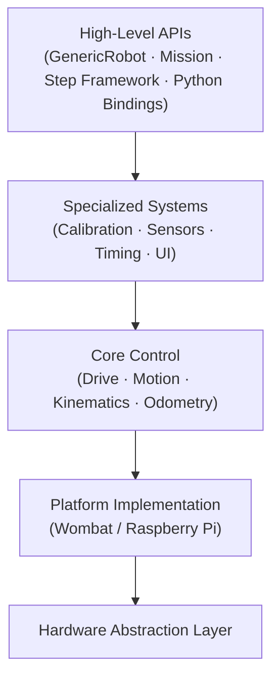

<div align="center">


# RaccoonLib

**The core robotics library powering RaccoonOS for Botball.**

PID motion control · Kinematics · Odometry · Step-based missions · Python bindings

[](COPYING)


> 📖 **Full documentation at [raccoon-docs.pages.dev](https://raccoon-docs.pages.dev/)**

</div>

---

RaccoonLib is the heart of [RaccoonOS](https://github.com/htl-stp-ecer) — a full robotics platform built for [Botball](https://www.kipr.org/botball/) competition. It gives your robot a solid foundation: reliable motion, clean sensor abstractions, and a step-based mission system that makes autonomous code readable and maintainable.

Built from years of competition experience at HTL St. Pölten, it's designed so that new teams don't have to start from zero.

---

## What's Inside

| Module | What it does |
|:-------|:-------------|
| **Motion Control** | PID-controlled `drive_forward`, `turn_right`, `drive_strafe` with feedforward compensation |
| **Calibration** | Auto-tune feedforward (kS, kV, kA) and PID via relay-feedback — no guessing |
| **Kinematics** | Differential and mecanum drivetrains — forward & inverse |
| **Odometry** | Real-time position and heading from wheel encoders + IMU fusion |
| **Step Framework** | `seq()`, `parallel()`, `.until()` — write missions like a readable recipe |
| **Sensors & Actuators** | IR sensors, buttons, servos — clean, consistent API |
| **Python Bindings** | Full Python API via pybind11 — same power, less boilerplate |

---

## Getting Started

> RaccoonLib runs on the [KIPR Wombat](https://www.kipr.org/kipr/hardware-software) controller (Raspberry Pi, ARM64). A mock platform for local development is not recommended — deploy directly to the Pi.

**1. Clone**

```bash
git clone https://github.com/htl-stp-ecer/raccoon-lib.git
cd raccoon-lib
```

**2. Build & deploy to your Pi in one step**

```bash
RPI_HOST=<your-pi-ip> bash deploy.sh
```

This cross-compiles for ARM64 via Docker and installs the wheel on your Pi over SSH. No local toolchain setup needed.

| Variable | Default | Description |
|:---------|:--------|:------------|
| `RPI_HOST` | *(required)* | Raspberry Pi IP address |
| `RPI_USER` | `pi` | SSH username |
| `RPI_DIR` | `/home/pi/python-libs` | Install directory |
| `BUILD_TYPE` | `Release` | CMake build type |

> **Starting a new robot project?** Use [`raccoon-cli`](https://github.com/htl-stp-ecer/raccoon-cli) to scaffold everything — `raccoon create project MyRobot` sets up the full project structure with hardware config, missions, and deploy scripts in one command.

---

## How It Works

Missions are Python classes. You describe *what the robot should do* — RaccoonLib handles the motion math.

```python
from libstp import *

class M01NavigateToZone(Mission):
    def sequence(self) -> Sequential:
        return seq([
            mark_heading_reference(),       # lock current heading as 0°

            parallel(
                drive_forward(cm=40),       # drive while lowering arm
                seq([
                    wait_until_distance(7),
                    Defs.arm_servo.hold(),
                ]),
            ),

            turn_right(degrees=90),

            # drive until both IR sensors see black tape
            drive_forward().until(
                on_black(Defs.front.left) & on_black(Defs.front.right)
            ),

            drive_backward(cm=3),
        ])
```

Your robot is a class too — define hardware once, reuse everywhere:

```python
from libstp import GenericRobot, DifferentialKinematics, Drive, FusedOdometry

class Robot(GenericRobot):
    kinematics = DifferentialKinematics(
        left_motor=Defs.left_motor,
        right_motor=Defs.right_motor,
        wheel_radius=0.0345,
        wheelbase=0.16,
    )
    drive    = Drive(kinematics=kinematics, ...)
    odometry = FusedOdometry(imu=Defs.imu, kinematics=kinematics, ...)

    missions = [M01NavigateToZone(), ...]
```

> See [`raccoon-example`](https://github.com/htl-stp-ecer/raccoon-example) for a fully commented, runnable reference robot with every concept demonstrated.

---

## Architecture



---

## Requirements

- CMake >= 3.15
- C++20 compatible compiler
- Python >= 3.11
- Docker (for ARM64 cross-compilation)

**C++ dependencies:** Eigen3 3.4.0 · LCM 1.5.0 · spdlog 1.14.1 · pybind11 2.13.6  
**Python dependencies:** pyyaml · aiosqlite

---

## Testing

```bash
# C++ tests
cmake -B build -DBUILD_TESTING=ON
cmake --build build
ctest --test-dir build

# Python tests
pytest tests/
```

---

## Part of RaccoonOS

RaccoonLib is one piece of the full platform:

| Repository | What it is |
|:-----------|:-----------|
| [raccoon-cli](https://github.com/htl-stp-ecer/raccoon-cli) | Dev toolchain — scaffolding, hardware wizard, `raccoon run` |
| [raccoon-example](https://github.com/htl-stp-ecer/raccoon-example) | Reference robot — start here if you're new |
| [raccoon-transport](https://github.com/htl-stp-ecer/raccoon-transport) | LCM messaging layer (C++, Python, Dart) |
| [documentation](https://raccoon-docs.pages.dev/) | Full platform docs |

---

## License

Copyright (C) 2026 Tobias Madlberger  
Licensed under the GNU General Public License v3.0 — see [COPYING](COPYING) for details.
